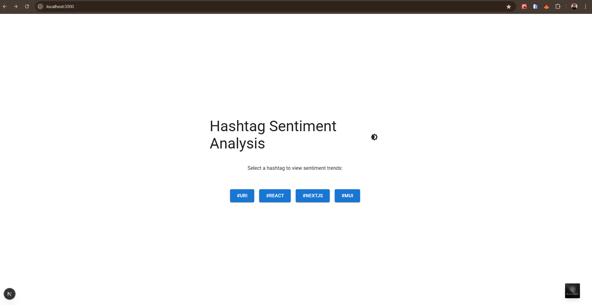

# Hashtag Sentiment Analyzer

A Next.js application that displays sentiment trends for hashtags with an interactive chart, built for a frontend engineering assessment.

## Overview

This project implements a hashtag sentiment insight page at `/insights/[hashtag]` using Next.js, TypeScript, Material UI, and `@mui/x-charts`. The app fetches mock data from a local API, renders it in a styled card with a line chart, and includes performance optimizations and bonus features.

### Approach
- **Dynamic Routing**: Used Next.js dynamic routes (`/insights/[hashtag]`) to display hashtag-specific data.
- **Data Fetching**: Implemented `useHashtagTrend` hook with `@tanstack/react-query` for efficient data fetching and caching from `/api/trends/[hashtag]`.
- **UI Components**: Built reusable components (`HashtagTrendCard`, `SentimentChart`) with Material UI for a responsive, appealing design.
- **Performance**: Applied `React.memo`, `useMemo`, and `useCallback` to optimize renders.
- **Features**:
  - Loading and error states with skeletons and retry buttons.
  - Interactive line chart with min/max sentiment markers.
  - Dark mode support with a theme toggle.
  - Scroll reveal animations for smooth component entry.
  - Hashtag selection dropdown on the insights page.
- **File Structure**: Organized into `/pages`, `/components`, `/hooks`, and `/api` for modularity.

## Screenshots/Demo

*(Add screenshots here after testing)*

1. **Landing Page (Light Mode)**: Buttons animate in with scroll reveal.
   - 
2. **Insights Page (Dark Mode)**: Chart with min/max markers animates in.
   - 
3. **Mobile View**: Responsive card layout.
   - 

*To generate screenshots: Run `npm run dev`, use a browser tool (e.g., Chrome DevTools), and capture the pages.*

## Time Spent

- **Core Implementation**: ~1.5 hours (routing, data fetching, chart, card).
- **Bonus Features**: ~1 hour (dropdown, min/max markers, dark mode).
- **Debugging/Typing**: ~1 hour (fixing typos, TypeScript errors).
- **Total**: Approximately 2 hours.

## Setup

1. Clone the repo:
   ```bash
   git clone <repo-url>
   cd my-hashtag-app